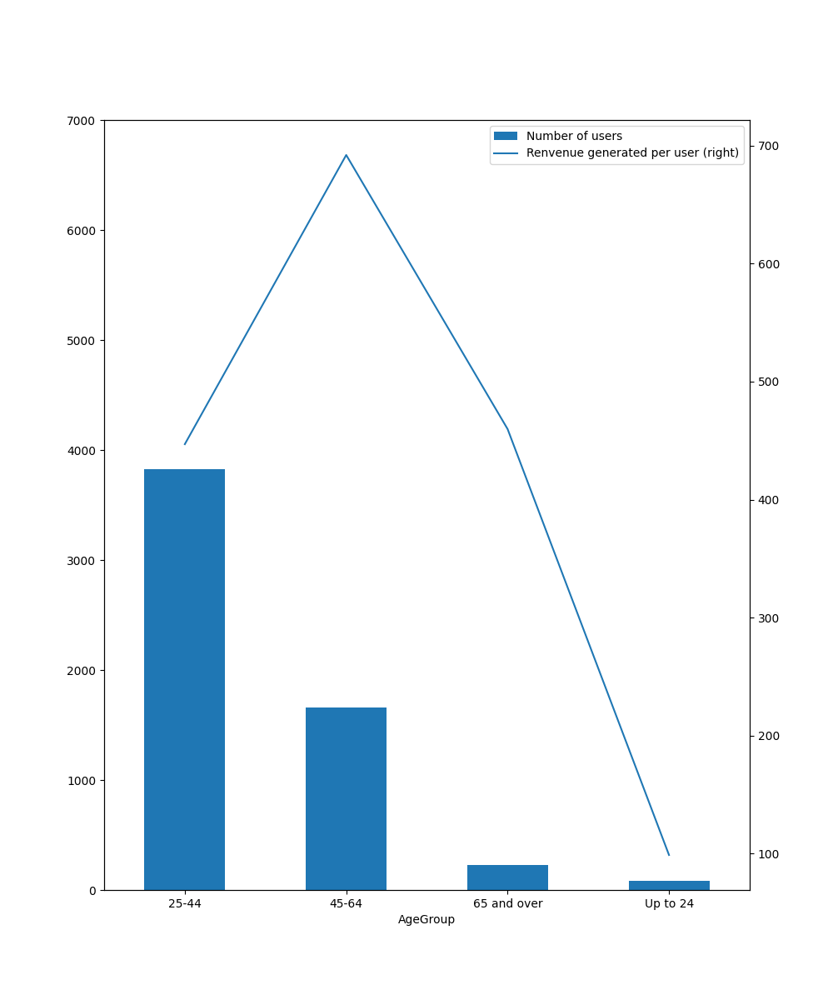

# Data Analysis Report
## Analysis Background
Customers of a company (dbo.Users) receive various offers (dbo.Offers). The company is interested in measuring the activity (dbo.Activity) resulting from communications (dbo.Comms) of these offers.

## Question 1: the average revenue for users by day of the week

## Question 2: the average revenue for users by day of the week

## Question 3: the number of revenue-generating users by year-month

## Question 4: the response rate of each offer

## Reflections and limitations
